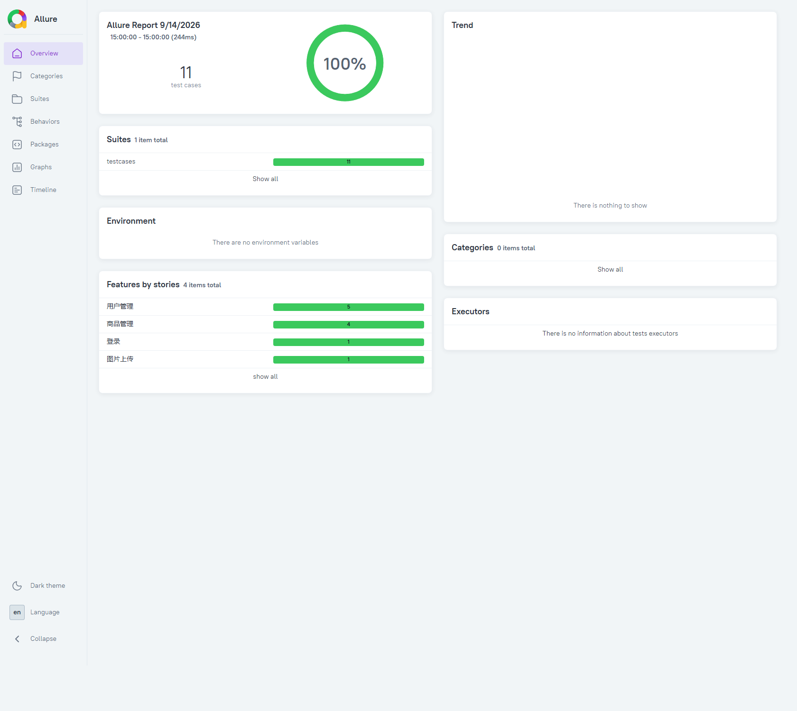

# 接口自动化测试项目（pytest + requests）

基于 **pytest + requests** 的 Excel 数据驱动接口自动化测试框架，覆盖 **登录、用户管理、商品管理、图片上传** 4 个模块共 **11 条用例**，支持 **HTTP 断言 + 数据库断言**、JSON/JDBC 变量提取与用例间传参，执行后一键生成 Allure 可视化报告。

## 技术栈

| 分类 | 技术 |
|---|---|
| 语言 | Python 3.13 |
| 测试框架 | pytest（参数化、夹具、pytest.ini 统一配置） |
| 请求发送 | requests |
| 数据驱动 | openpyxl（Excel）+ Jinja2（变量渲染） |
| 数据提取 | jsonpath（响应提取）、pymysql（数据库提取） |
| 测试报告 | allure-pytest（三级目录 + 步骤 + 附件） |
| 日志 | logging（CLI 实时日志 + 文件日志） |

## 项目结构

```
test_project/
├── run.py                  # 测试入口：一键执行用例并生成 Allure 报告
├── pytest.ini              # pytest 配置（日志格式、日志文件）
├── config/
│   └── config.py           # 环境配置（服务地址、Excel 路径、数据库连接）
├── testcases/
│   └── test_runner.py      # 用例执行器（框架核心）
├── data/
│   └── 测试数据.xlsx        # 测试用例（数据驱动）
├── utils/
│   ├── excel_utils.py      # 读取 Excel 用例
│   ├── analyse_case.py     # 解析请求数据并组装 URL/参数
│   ├── send_request.py     # 发送 HTTP 请求 / JDBC 查询
│   ├── asserts.py          # HTTP 断言 + 数据库断言
│   ├── extractor.py        # JSON 提取 + JDBC 提取
│   └── allure_utils.py     # Allure 报告动态打标
├── file/                   # 图片上传用例的测试附件
├── log/                    # 运行日志
└── report/                 # 测试报告（已 gitignore）
```

## 核心设计

**1. Excel 数据驱动，用例与代码分离**
所有用例以行为单位存放在 `data/测试数据.xlsx`，字段包含请求方式、路径、请求头、params / json / data / files 参数、校验字段、预期结果、数据库校验、提取表达式、是否执行。新增或调整用例无需改动代码；`is_true` 列可直接临时禁用某条用例。

**2. Jinja2 变量池解决用例间依赖**
用例中可用 `{{token}}`、`{{JAY_ID}}`、`{{SHOP_ID}}` 等占位符引用前序用例提取的值。执行时通过 Jinja2 渲染 + `eval` 还原为 dict，实现「登录拿到 token → 后续用例自动带上」「创建用户拿到 ID → 修改/删除复用」。

**3. 双层断言：HTTP 断言 + 数据库断言**
- HTTP 断言：优先用 jsonpath 精确比对字段值，无 jsonpath 时退化为响应文本模糊匹配；
- **JDBC 断言**：直接查库校验接口是否真正写库成功（如新增用户后校验 `user_name` 是否落库），避免「接口返回成功但数据没落库」的漏测。

**4. 提取器：接口间数据传递**
支持 jsonpath 从响应中提取（如 `$..token`）和 SQL 从数据库提取（如新用户 ID），统一存入全局变量池供后续用例渲染使用。

**5. Allure 报告**
动态标注 `feature / story / title` 形成三级目录，`@allure.step` 展示「解析请求数据 → 发送请求 → 断言 → 提取」完整步骤，请求数据以附件形式记录，失败可定位到具体参数。

**6. 幂等设计（可重复执行）**
用户、商品用例均采用「创建 → 修改 → 删除」闭环，测试数据自动清理；商品删除为软删除且 `goods_name` 有唯一索引，因此商品名使用 `{{now}}`（运行时间戳）动态生成，保证反复执行不冲突，**重跑无需手动清库**。

**7. 日志**
`pytest.ini` 统一配置，CLI 实时输出 + `log/` 文件落盘，格式含文件名、方法名、行号、日志级别，便于问题回溯。

## 用例清单

| 编号 | 模块 | 场景 | 请求 | 说明 |
|---|---|---|---|---|
| 1 | 登录 | 登录成功 | POST /login | 提取 token，校验数据库登录信息 |
| 2 | 用户管理 | 未登录查询失败 | GET /users | 无 token 鉴权失败场景 |
| 3 | 用户管理 | 查询成功 | GET /users | 查询用户列表 |
| 4 | 用户管理 | 创建成功 | POST /users | 提取新用户 ID 供后续用例复用 |
| 5 | 用户管理 | 修改成功 | PUT /users/{{JAY_ID}}/state/true | 使用提取的 ID 修改状态 |
| 6 | 用户管理 | 删除成功 | DELETE /users/{{JAY_ID}} | 使用提取的 ID 删除，闭环清理 |
| 7 | 图片上传 | 上传成功 | POST /upload | 上传 png 附件，校验返回地址 |
| 8 | 商品管理 | 查询成功 | GET /goods | 查询商品列表 |
| 9 | 商品管理 | 创建成功 | POST /goods | 商品名动态生成，提取商品 ID |
| 10 | 商品管理 | 修改成功 | PUT /goods/{{SHOP_ID}}/state/1 | 使用提取的 ID 修改状态 |
| 11 | 商品管理 | 删除成功 | DELETE /goods/{{SHOP_ID}} | 使用提取的 ID 删除，闭环清理 |

## 运行

```bash
# 1. 安装依赖
pip install pytest requests openpyxl jinja2 jsonpath pymysql allure-pytest

# 2. 启动被测服务（vueShop-api-server，监听 127.0.0.1:8888）
#    并确认 config/config.py 中数据库连接配置正确

# 3. 执行用例并生成报告
python run.py

# 4. 查看报告
#    浏览器打开 ./report/html_report/index.html
```

## 测试报告

最新运行：11 条用例，**全部通过**，4 个业务模块覆盖率 100%。



## 环境要求

- Python 3.8+
- 被测服务：vueShop-api-server（`http://127.0.0.1:8888/api/private/v1`）
- 数据库：MySQL（用于数据库断言与提取）
- Allure 命令行工具（用于渲染 HTML 报告）

## 说明

本项目为个人接口自动化学习实践项目，用来练习测试框架的分层设计、数据驱动、断言体系与报告输出。
